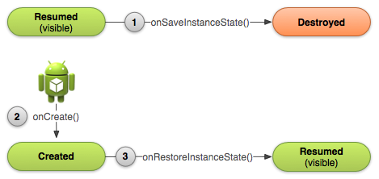

# 액티비티 재생성

> 사용자가 Back버튼을 누르거나 finish()를 호출하거나 비정상 종료 등으로 액티비티가 종료되는 경우<br>
> Activity 인스턴스에 대한 모든 정보가 완전히 사라지게 된다.<br>
> 하지만 시스템이 Activity인스턴스가 존재하고 있음을 기억하고 있는데<br>
> 이를 이용하여 종료가 되어도 인스턴스의 정보를 저장하고 사용할 수 있다.<br>

> tip! <br>
> 사용자가 화면을 회전할 때마다 액티비티가 소멸되고 재생성된다<br>

### 1. 흐름도


### 2. 상태저장
onSaveInstanceState()메소드를 오버라이드한다.<br>
액티비티가 종료되기 이 메소드가 실행된다.
``` java
@Override
public void onSaveInstanceState(Bundle savedInstanceState) {
    // Save the user's current game state
    savedInstanceState.putInt(STATE_SCORE, mCurrentScore);
    savedInstanceState.putInt(STATE_LEVEL, mCurrentLevel);

    // Always call the superclass so it can save the view hierarchy state
    super.onSaveInstanceState(savedInstanceState);
}
```
> 주의 : super.onSaveInstanceState()를 사용하여 뷰 계층 구조의 상태를 기본 저장할 수 있도록 한다.

### 3. 상태복원
``` java
public void onRestoreInstanceState(Bundle savedInstanceState) {
    // Always call the superclass so it can restore the view hierarchy
    super.onRestoreInstanceState(savedInstanceState);

    // Restore state members from saved instance
    mCurrentScore = savedInstanceState.getInt(STATE_SCORE);
    mCurrentLevel = savedInstanceState.getInt(STATE_LEVEL);
}
```
